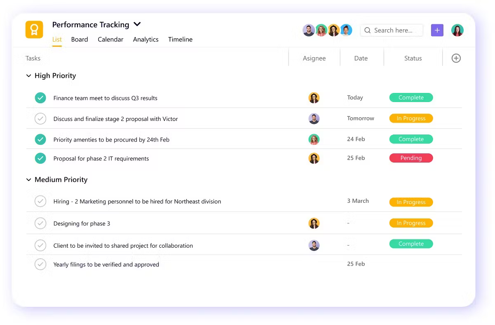

# Project Description: Collaborative To-Do List Web App

The goal is to create a web application that allows users to manage a shared to-do list. The app should enable adding, viewing, updating, and deleting tasks, with the data persisting across sessions. The project must be managed using Git for version control and Docker for containerization.

example to take inspiration from:

## Application Architecture

This project requires implementing a multi-component application with:

### 1. Frontend Component
- Web-based user interface accessible via browser
- Responsible for displaying tasks and providing interactive elements
- Communicates with the backend via API calls

### 2. Backend Component
- Server application that handles business logic
- Provides API endpoints for the frontend to consume
- Processes task creation, updates, and deletions
- Communicates with the database for persistence

### 3. Database Component
- Stores task data persistently
- Allows data to survive application restarts
- Should be containerized along with the other components

### 4. Docker Infrastructure
- Each component should be containerized separately
- Docker Compose should be used to define and run the multi-container application
- Network configuration to allow components to communicate with each other

## Requirements

- **Core Functionality**
  - Users can add a new task with a description.
  - Users can view a list of all existing tasks.
  - Users can mark a task as complete or incomplete.
  - Users can delete a task.
  - Task data persists (e.g., stored somewhere, not just in memory).

- **User Interface**
  - The app has a web-based interface accessible via a browser.
  - The interface displays the task list in a readable format.
  - There are input mechanisms (e.g., buttons, forms) to add, update, and delete tasks.
  - The design is functional (no need for advanced styling, but must be usable).

- **Git Usage**
  - The project is stored in a single Git repository.
  - Each digispec creates at least one branch for their contributions.
  - Changes are merged into a main branch via pull requests or similar workflow.

- **Docker Usage**
  - Components of the app are containerized.
  - The app in its entirety can be set up with docker compose.

- **Collaboration**
  - The team divides responsibilities to complete the project.
  - Evidence of teamwork exists in the Git history (e.g., merged branches, comments).
  - The final product integrates all contributions into a working whole.

- **Documentation**
  - A README file with setup instructions

## Detailed Functionality Specifications
- these are suggestions, you can design the app as you see fit

### Task Management
- **Task Creation**
  - A form with a text input field for task description
  - Submit button to add the task to the list
  - Priority level selection (High, Medium, Low)
  - Due date selection via date picker
  - Form validation to prevent empty submissions

- **Task Display**
  - List view showing all tasks with their current status
  - Each task shows: description, completion status, creation date
  - Tasks should be visually distinguishable (complete vs. incomplete)
  - Sort tasks by creation date, completion status, or priority
  - Filter tasks by status (All, Active, Completed)

- **Task Updates**
  - Checkbox or toggle button to mark tasks as complete/incomplete
  - Visual indication of task completion (e.g., strikethrough, color change)
  - Edit button to modify task description after creation
  - Ability to update task priority or due date

- **Task Deletion**
  - Delete button for each task
  - Confirmation dialog before deletion
  - Bulk delete option for completed tasks

## Achievement Ladder

Each tier builds upon the previous one, creating a clear path to follow.

### Tier 1: Getting Started 🚀
**Mission**: Set up the project structure and get familiar with the tools.

**Checkpoints**:
- [x] Initialize a Git repository with a README
- [x] Create a simple frontend web page that displays a static list of tasks
- [x] Set up a basic backend server that can respond to requests
- [x] Create Dockerfiles for both frontend and backend components
- [x] Each team member makes at least one commit

**Victory Condition**: Show a working frontend and backend running in separate containers, even if they don't communicate yet.

### Tier 2: Not bad🔧
**Mission**: Implement core functionality with proper component communication.

**Checkpoints**:
- [x] Set up a database component (can be a simple JSON file to start)
- [x] Create API endpoints in the backend for basic CRUD operations
- [x] Connect the frontend to the backend API
- [ ] Implement task creation and viewing in the UI
- [ ] Implement task completion toggling and deletion
- [ ] Create feature branches for different components/functionality
- [x] Set up Docker Compose to run all components together
- [ ] Update README with basic setup instructions

**Victory Condition**: Demonstrate a functional to-do app with all components working together, where tasks persist between page refreshes.

### Tier 3: Pretty good👍
**Mission**: Polish the application and demonstrate effective teamwork across components.

**Checkpoints**:
- [ ] Implement a clean, intuitive UI with proper styling
- [ ] Add task filtering (All, Active, Completed) in the frontend
- [ ] Enhance the backend with proper error handling and validation
- [x] Upgrade to a more robust database solution if using a simple file
- [ ] Ensure data persistence is robust (survives container restarts)
- [x] Establish a proper Git workflow with meaningful commit messages
- [x] Optimize Docker configuration (appropriate base images, port mapping)
- [x] Each team member contributes to different components
- [ ] Create comprehensive documentation including architecture diagram

**Victory Condition**: Present a polished application with all three components (frontend, backend, database) working together seamlessly.

### Tier 4: Chad Status ✨
**Mission**: Extend the application with advanced features across all components.

**Checkpoints**:
- [ ] Implement priority levels for tasks (UI + API + database schema)
- [ ] Add due dates with visual indicators
- [ ] Create task categories or tags
- [ ] Implement bulk actions (delete completed, mark all as complete)
- [ ] Add real-time updates between users (e.g., WebSockets)
- [ ] Implement proper API authentication/security
- [ ] Optimize Docker for production (multi-stage builds, environment variables)
- [ ] Add automated tests for frontend and backend components
- [ ] Implement database migrations or schema versioning

**Victory Condition**: Showcase an application with advanced features that demonstrates technical excellence across all components.

### Tier 5: Gigachad Status 🏆
**Mission**: Transform the project into a production-ready application.

**Checkpoints**:
- [ ] Implement user accounts or session management
- [ ] Add collaborative features (assigned tasks, comments)
- [ ] Create a responsive design that works on different screen sizes
- [ ] Implement keyboard shortcuts and accessibility features
- [ ] Set up a CI/CD pipeline for automated testing/deployment
- [ ] Implement database backups and recovery procedures
- [ ] Add performance monitoring and logging across components
- [ ] Deploy the application to a cloud provider
- [ ] Create a compelling demo with example scenarios
- [ ] Document the team's journey and lessons learned

**Victory Condition**: Deliver a near-production quality application with professional architecture and workflows.

## Notes
- Reaching Tier 2 is a solid achievement, and Tier 3 is excellent for a one-week project.
- Focus on learning and collaboration rather than rushing through features.
- Document your progress and challenges throughout the project.
- Presentation at the end of project